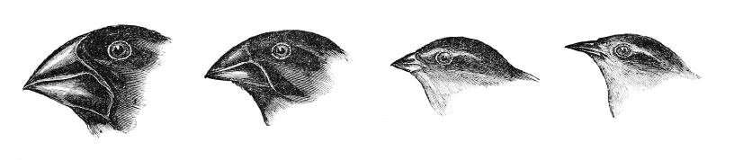
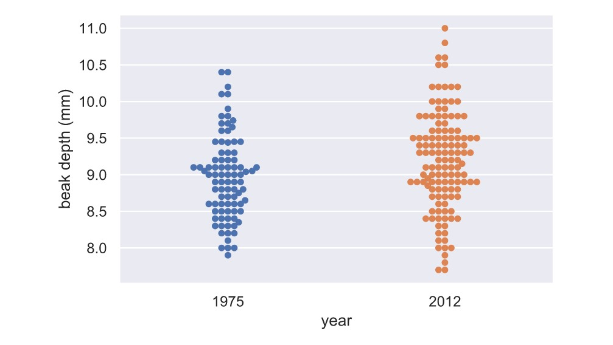
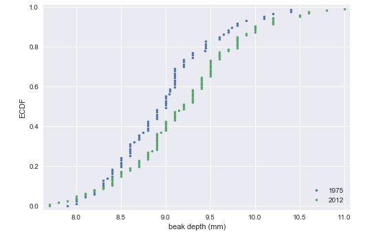
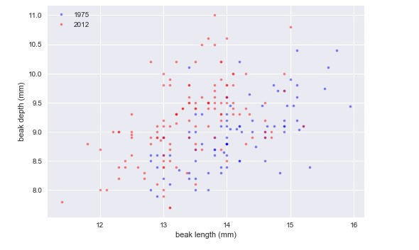
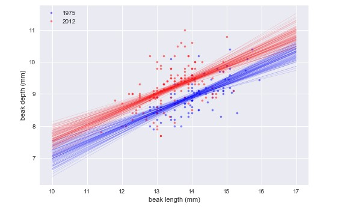

<h2 align='center'>Darwinian Evolution in Action <br>Finch Beaks and Statistics</h2>
<p align='center'>
  
</p>

<p><a href='https://github.com/shukkkur/Finch-Beaks-And-Statistics/tree/main/datasets' target="_blank">Data</a> from Peter and Rosemary Grant research of Darwin's finches on Galápagos island of Daphne Major. 
</p>

<br>

<h3>1. EDA of beak depths of Darwin's finches</h3>
<p>First let's see how the beak depth (the distance, top to bottom, of a closed beak) of the finch species <i>Geospiza scandens</i> has changed over time. </p>

```python
_ = sns.swarmplot(x='year', y='beak_depth', data=df)
```


<p>It's hard to see if there is a clear difference between the <b>1975</b> and <b>2012</b> data set. But, it appears as the mean of the 2012 dataset might be slightly higher, and it might have a bigger variance.</p>


<h4>ECDFs of beak depths</h4>

```python
x_1975, y_1975 = ecdf(bd_1975)
x_2012, y_2012 = ecdf(bd_2012)

_ = plt.plot(x_1975, y_1975, marker='.', linestyle='none')
_ = plt.plot(x_2012,y_2012, marker='.', linestyle='none')
```


<p>The differences are much clearer in the ECDF. The mean is larger in the 2012 data, and the variance does appear larger as well.</p>


<h4>Parameter estimates of beak depths</h4>

```python
# the difference of the sample means: mean_diff
mean_diff = diff_of_means(bd_2012,bd_1975)

# bootstrap replicates of means
bs_replicates_1975 = draw_bs_reps(bd_1975, np.mean, size=10000)
bs_replicates_2012 = draw_bs_reps(bd_2012, np.mean, size=10000)

# samples of difference of means: bs_diff_replicates
bs_diff_replicates = bs_replicates_2012 - bs_replicates_1975

# 95% confidence interval: conf_int
conf_int = np.percentile(bs_diff_replicates, [2.5, 97.5])

print('difference of means =', mean_diff, 'mm')
print('95% confidence interval =', conf_int, 'mm')

>>> difference of means = 0.22622047244094645 mm
>>> 95% confidence interval = [0.05633521 0.39190544] mm
```

<h3>Hypothesis test: Are beaks deeper in 2012?</h3>
<p>The ECDF and determination of the confidence interval make it pretty clear that the beaks of G. scandens on Daphne Major have gotten deeper. But is it possible that this effect is just due to random chance? In other words, what is the probability that we would get the observed difference in mean beak depth if the means were the same?</p>

```python
combined_mean = np.mean(np.concatenate((bd_1975, bd_2012)))

# Shift the samples
bd_1975_shifted = bd_1975 - np.mean(bd_1975) + combined_mean
bd_2012_shifted = bd_2012 - np.mean(bd_2012) + combined_mean

# Bootstrap replicates of shifted data sets
bs_replicates_1975 = draw_bs_reps(bd_1975_shifted, np.mean, size=10000)
bs_replicates_2012 = draw_bs_reps(bd_2012_shifted, np.mean, size=10000)

bs_diff_replicates = bs_replicates_2012 - bs_replicates_1975

# p-value
p = np.sum(bs_diff_replicates >= mean_diff) / len(bs_diff_replicates)

print('p =', p)

>>> p = 0.0034 
```
<p>p-value of <code>0.0034</code> suggests that there is a <b>statistically significant difference</b>.<br>That means, the beak length have changed over the course of 37 years.</p>

<h3>EDA of beak length and depth</h3>

```python
# scatter plot of 1975 data
_ = plt.plot(bl_1975, bd_1975, marker='.', linestyle='None', color='blue', alpha=0.5)

# scatter plot of 2012 data
_ = plt.plot(bl_2012, bd_2012, marker='.', linestyle='None', color='red', alpha=0.5)

plt.show()
```



<p>Looking at the plot, we see that beaks got deeper and a bit shorter. So, it does not look like the beaks kept the same shape; they became <i>shorter and deeper</i>.</p>


<h4>Displaying the Linear regression Results</h4>
<p><i>Code can be found <a href='notebook.ipynb' target="_blank">here</a></i></p>



```python
1975: slope = 0.4652051691605937 conf int = [0.33310645 0.58996223]
1975: intercept = 2.3908752365842263 conf int = [0.60754109 4.21248022]
2012: slope = 0.462630358835313 conf int = [0.33060855 0.60024108]
2012: intercept = 2.9772474982360198 conf int = [1.15365093 4.72831245]
```
<p>It looks like they have the same slope, but different intercepts.</p>

